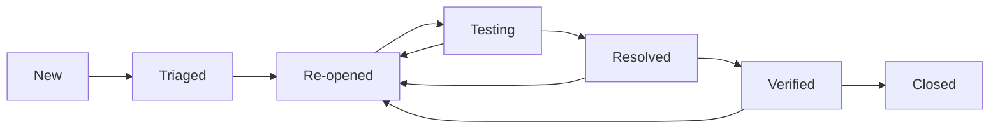

# 406_bug_tracking_system.md

**LEVEL 6: DEFECT MANAGEMENT - CLI-Specific Bug Tracking & Performance Regression**  
**Document Links**: ← [405_test_execution_checklist.md](405_test_execution_checklist.md) | → [407_test_summary_reports.md](407_test_summary_reports.md)

## 1. Bug Tracking System Overview

### 1.1 Current Bug Status Framework
**Bug Tracking Infrastructure**:
- **Primary System**: GitHub Issues (https://github.com/vn6295337/askme/issues)
- **Monitoring**: Automated via GitHub Actions
- **Reporting**: Integrated bug report templates
- **Escalation**: Automated alert system for critical issues

### 1.2 Bug Classification Standards
**Severity Levels**:
- **Critical (P0)**: ❌ System crashes, security vulnerabilities - 2 hour response
- **High (P1)**: ⚠️ Core functionality issues - 8 hour response  
- **Medium (P2)**: ⬜ Feature issues - 24 hour response
- **Low (P3)**: ⬜ Minor improvements - 5 business day response

## 2. CLI-Specific Bug Templates

### 2.1 CLI Command Issues Template
```markdown
**Bug Type**: CLI Command Issue
**Priority**: [Critical/High/Medium/Low]
**Environment**: 
- OS: [Linux/macOS/Windows WSL]
- CLI Version: [./askme --version output]
- Java Version: [java -version output]

**Command That Failed**:
```bash
[Exact command that caused the issue]
```

**Expected Behavior**: [What should have happened]
**Actual Behavior**: [What actually happened]
**Error Output**: [Complete error message and stack trace]

**Steps to Reproduce**:
1. [First step]
2. [Second step] 
3. [Third step]

**Configuration Details**:
- Provider configured: [google/mistral/openai/anthropic]
- Configuration file permissions: [ls -la ~/.askme/config.json]
- Network connectivity: [ping google.com result]

**Additional Context**: [Any other relevant information]
```

### 2.2 Provider Integration Issues Template
```markdown
**Bug Type**: Provider Integration
**Priority**: [Critical/High/Medium/Low]
**Provider**: [Google Gemini/Mistral AI/OpenAI/Anthropic]
**Provider Status**: [Live/Framework/Blocked]

**API Details**:
- Provider endpoint: [API URL if known]
- Authentication method: [API key/OAuth/etc]
- Error response: [Provider error message]

**CLI Command**: [Command that triggered the provider issue]
**Provider Response Time**: [If measurable]
**Network Status**: [Online/Offline/Limited]

**Failover Behavior**:
- Did failover trigger: [Yes/No]
- Fallback provider used: [Provider name]
- User experience impact: [Description]

**Additional Logs**: [Any relevant logs or network traces]
```

### 2.3 Security Issues Template
```markdown
**Bug Type**: Security Issue
**Priority**: CRITICAL [Auto-escalated]
**Security Domain**: [Input Validation/Network/Configuration/Data Protection]

**Security Issue Description**: [Clear description of security concern]
**Potential Impact**: [What could be compromised]

**Reproduction Steps** (if safe):
1. [Step 1]
2. [Step 2]
3. [Result]

**Evidence**:
- Network traces: [Attach if applicable]
- Configuration files: [Sanitized excerpts]
- Error logs: [Relevant portions]

**Immediate Mitigation**: [What was done to contain the issue]

**Environment Details**:
- CLI version: [Version]
- Configuration: [Sanitized config details]
- Network environment: [Isolated/Production/etc]

⚠️ **Security Issue Protocol**: Automatically escalated to security team
```

### 2.4 Performance Regression Template
```markdown
**Bug Type**: Performance Regression
**Priority**: [High/Medium based on impact]
**Performance Metric**: [Response Time/Build Time/Memory Usage/Startup Time]

**Performance Baseline**:
- Previous performance: [Measurement]
- Current performance: [Measurement]
- Regression percentage: [Calculate difference]

**Target vs Actual**:
- Response time target: <2s | Actual: [measurement]
- Build time target: <2min | Actual: [measurement] 
- Memory usage: [baseline vs current]

**Command/Scenario**: [Specific command or scenario showing regression]
**Measurement Method**: [How performance was measured - time command, etc]

**Environment**:
- Hardware: [CPU, RAM, storage type]
- Network: [Connection speed, latency]
- Load: [Concurrent processes, system load]

**Regression Analysis**:
- When first noticed: [Date/version]
- Potential causes: [Recent changes]
- Impact on users: [Description]

**Performance Evidence**: [Performance measurement output]
```

## 3. Provider Context Fields

### 3.1 Google Gemini Provider Context
```yaml
Provider: Google Gemini
Status: ✅ LIVE & OPERATIONAL
API Version: v1
Authentication: API Key
Endpoint: https://generativelanguage.googleapis.com/v1/models/gemini-pro:generateContent
Failover Priority: 1 (Primary)
Security Status: ✅ Certificate pinning active

Bug Tracking Fields:
- Provider ID: GEMINI
- Integration Status: LIVE
- Error Codes: [Provider-specific error mapping]
- Escalation Path: [Primary provider issues → High priority]
```

### 3.2 Mistral AI Provider Context  
```yaml
Provider: Mistral AI
Status: ✅ LIVE & OPERATIONAL
API Version: v1
Authentication: API Key
Endpoint: https://api.mistral.ai/v1/chat/completions
Failover Priority: 2 (Secondary)
Security Status: ✅ Certificate pinning active

Bug Tracking Fields:
- Provider ID: MISTRAL
- Integration Status: LIVE
- Error Codes: [Provider-specific error mapping]
- Escalation Path: [Secondary provider issues → Medium priority]
```

### 3.3 Llama Provider Context
```yaml
Provider: Llama
Status: ✅ LIVE & OPERATIONAL
API Version: v1
Authentication: API Key
Endpoint: https://api.together.xyz/v1/chat/completions
Failover Priority: 3 (Tertiary)
Security Status: ✅ Certificate pinning active

Bug Tracking Fields:
- Provider ID: LLAMA
- Integration Status: LIVE
- Error Codes: [Provider-specific error mapping]
- Escalation Path: [Tertiary provider issues → Low priority]
```

## 4. Security Issue Classification

### 4.1 Severity Level Framework

#### 4.1.1 CRITICAL (P0) - Immediate Response Required
**Response Time**: Within 2 hours  
**Security Impact**: Data exposure, remote code execution, authentication bypass

**Examples**:
- API key exposure in logs or memory
- Unauthorized file system access
- Complete authentication bypass
- Remote code execution vulnerabilities
- Privacy breach or data exposure

**Escalation Process**:
1. Immediate notification to security team
2. Service isolation if necessary
3. Emergency patch development
4. User notification if data at risk
5. Post-incident security review

#### 4.1.2 HIGH (P1) - Same Day Response  
**Response Time**: Within 8 hours  
**Security Impact**: Input validation bypass, denial of service, configuration tampering

**Examples**:
- Input validation bypass
- Denial of service vulnerabilities
- Configuration tampering possibilities
- Network security degradation
- Performance security impact

**Resolution Process**:
1. Security team assessment
2. Risk evaluation and containment
3. Patch development and testing
4. Staged rollout with monitoring
5. Security documentation update

#### 4.1.3 MEDIUM (P2) - Next Business Day
**Response Time**: Within 24 hours  
**Security Impact**: Information disclosure (non-sensitive), minor validation issues

**Examples**:
- Information disclosure (non-sensitive)
- Minor input validation issues
- Configuration hardening opportunities
- Non-critical security warnings
- Security best practice improvements

#### 4.1.4 LOW (P3) - Within One Week
**Response Time**: Within 5 business days  
**Security Impact**: Documentation gaps, hardening recommendations

**Examples**:
- Security documentation gaps
- Hardening recommendations
- Non-exploitable security findings
- Preventive security measures
- Security code quality improvements

### 4.2 Security Issue Tracking Template
```yaml
Issue ID: SEC-YYYY-MM-DD-###
Severity: [CRITICAL/HIGH/MEDIUM/LOW]
Status: [Open/In Progress/Testing/Resolved/Closed]
Discovery Date: [YYYY-MM-DD]
Reporter: [Name/Automated/External]
Component: [CLI/Provider/Config/Network]

Description: |
  [Detailed security issue description]

Impact Assessment:
  Confidentiality: [High/Medium/Low/None]
  Integrity: [High/Medium/Low/None]
  Availability: [High/Medium/Low/None]
  
Technical Details:
  Attack Vector: [Local/Network/Physical]
  Complexity: [Low/High]
  Privileges Required: [None/Low/High]
  User Interaction: [None/Required]

Affected Components:
  - [Component 1]
  - [Component 2]

Remediation:
  Short-term: [Immediate mitigation steps]
  Long-term: [Permanent fix approach]
  Testing: [Verification method]

Timeline:
  Discovery: [Date]
  Assessment: [Date]
  Fix Development: [Date]
  Testing: [Date]
  Deployment: [Date]
  Verification: [Date]
```

## 5. Performance Regression Tracking

### 5.1 Performance Baseline Metrics Framework

#### 5.1.1 Response Time Baselines
```yaml
Single Query Response Time:
  Target: <2.0 seconds
  Alert Threshold: >2.2 seconds (10% regression)
  Critical Threshold: >3.0 seconds (50% regression)

Large Prompt Processing:
  Target: <3.0 seconds (1000+ words)
  Alert Threshold: >3.3 seconds
  Critical Threshold: >4.5 seconds

Concurrent Query Handling:
  Target: <2.5 seconds (5 concurrent)
  Alert Threshold: >2.8 seconds
  Critical Threshold: >4.0 seconds
```

#### 5.1.2 Build Performance Baselines
```yaml
Clean Build Time:
  Target: <120 seconds (2 minutes)
  Alert Threshold: >130 seconds
  Critical Threshold: >180 seconds

Incremental Build Time:
  Target: <30 seconds
  Alert Threshold: >35 seconds
  Critical Threshold: >60 seconds

Startup Time:
  Target: <1.0 second (cold start)
  Alert Threshold: >1.2 seconds
  Critical Threshold: >2.0 seconds
```

#### 5.1.3 Memory Usage Baselines
```yaml
CLI Startup Memory:
  Target: <50MB resident memory
  Alert Threshold: >55MB
  Critical Threshold: >100MB

Query Processing Memory:
  Target: <100MB peak during query
  Alert Threshold: >110MB
  Critical Threshold: >200MB

Memory Leak Detection:
  Target: 0MB growth over 100 queries
  Alert Threshold: >5MB growth
  Critical Threshold: >20MB growth
```

### 5.2 Performance Regression Detection Framework

#### 5.2.1 Automated Performance Monitoring
```yaml
GitHub Actions Performance Tests:
  Frequency: Every commit to main branch
  Test Suite: performance_regression_tests.yml
  Metrics Collected:
    - Response time for standard queries
    - Build time measurement
    - Memory usage profiling
    - Startup time measurement

Alert Conditions:
  Warning: 10% regression from baseline
  Critical: 25% regression from baseline
  
Notification Channels:
  - GitHub issue creation (automated)
  - Performance dashboard update
  - Development team notification
```

#### 5.2.2 Performance Issue Template
```markdown
**Performance Regression Detected**
**Alert Level**: [Warning/Critical]
**Metric**: [Response Time/Build Time/Memory/Startup]
**Regression**: [Percentage] from baseline

**Current Performance**:
- Measured: [Current value]
- Baseline: [Baseline value] 
- Target: [Target value]
- Regression: [Percentage/absolute difference]

**Test Details**:
- Test Command: [Specific command tested]
- Environment: [Test environment details]
- Measurement Method: [How metric was collected]
- Test Iterations: [Number of measurements]

**Historical Trend**:
- Last 7 days: [Trend data]
- Last 30 days: [Trend data]
- Since baseline: [Overall trend]

**Potential Causes**:
- Recent commits: [Link to recent changes]
- Dependencies: [Any dependency updates]
- Environment: [Environmental changes]

**Impact Assessment**:
- User experience: [Description of impact]
- Production readiness: [Assessment]
- Urgency: [High/Medium/Low]

**Next Steps**:
1. [Investigation steps]
2. [Performance profiling]
3. [Fix development]
4. [Verification testing]
```

## 6. Bug Lifecycle Management

### 6.1 Bug States and Transition Framework

#### 6.1.1 Bug Lifecycle States


#### 6.1.2 State Definitions
- **New**: Bug reported but not yet assessed
- **Triaged**: Bug assessed, priority assigned, developer assigned
- **In Progress**: Active development of fix
- **Testing**: Fix implemented, undergoing testing
- **Resolved**: Fix complete, ready for verification
- **Verified**: Fix confirmed working by reporter/QA
- **Closed**: Bug officially closed, fix deployed
- **Re-opened**: Bug reoccurred or fix insufficient

### 6.2 Priority-Based SLA Framework

#### 6.2.1 Critical Issues (P0)
- **Response Time**: 2 hours
- **Resolution Target**: 24 hours
- **Escalation**: Immediate security team notification
- **Communication**: Hourly updates until resolved

#### 6.2.2 High Priority Issues (P1)
- **Response Time**: 8 hours
- **Resolution Target**: 3 business days
- **Escalation**: Daily management review
- **Communication**: Daily updates

#### 6.2.3 Medium Priority Issues (P2)
- **Response Time**: 24 hours
- **Resolution Target**: 1 week
- **Escalation**: Weekly review
- **Communication**: Bi-weekly updates

#### 6.2.4 Low Priority Issues (P3)
- **Response Time**: 3 business days
- **Resolution Target**: 4 weeks
- **Escalation**: Monthly review
- **Communication**: Monthly updates

## 7. Bug Prevention and Quality Framework

### 7.1 Proactive Monitoring Strategy
**Reference**: Execution monitoring from [405_test_execution_checklist.md](405_test_execution_checklist.md)

**Monitoring Components**:
1. **Automated Testing**: Comprehensive test suite execution when environment allows
2. **Performance Baselines**: Continuous monitoring of performance regressions
3. **Security Scanning**: Regular dependency and code security analysis
4. **User Feedback**: Active monitoring of user-reported issues
5. **Provider Health**: Continuous monitoring of LLM provider status

### 7.2 Quality Maintenance Framework
**Quality Standards Reference**: [401_test_strategy_overview.md](401_test_strategy_overview.md)

**Maintenance Procedures**:
1. **Weekly Code Reviews**: Regular assessment of code quality and security
2. **Monthly Security Audits**: Ongoing security posture evaluation
3. **Quarterly Performance Reviews**: Deep performance analysis and optimization
4. **Continuous Documentation**: Keeping all procedures and guides current
5. **External Audits**: Annual third-party security and quality assessments

### 7.3 Bug Metrics and Reporting Framework
**Reference**: Complete metrics in [407_test_summary_reports.md](407_test_summary_reports.md)

**Metrics Collection**:
- **Bug Discovery Rate**: Trends and patterns in issue identification
- **Resolution Efficiency**: Time-to-fix and first-time fix rates
- **Quality Impact**: Impact of bugs on overall system quality
- **Prevention Success**: Effectiveness of proactive measures
- **User Experience**: Impact on user satisfaction and adoption