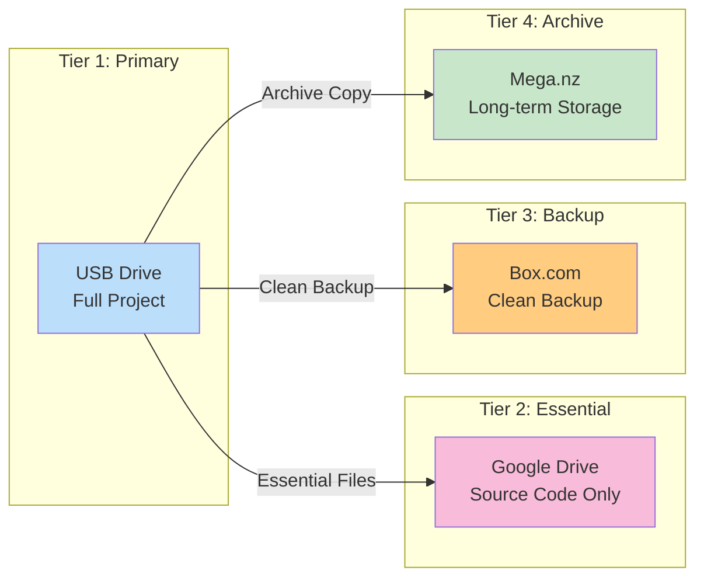
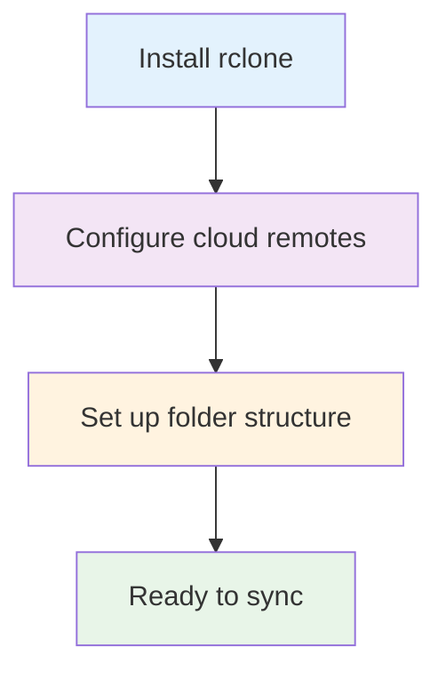
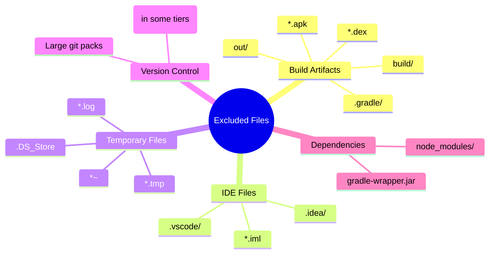
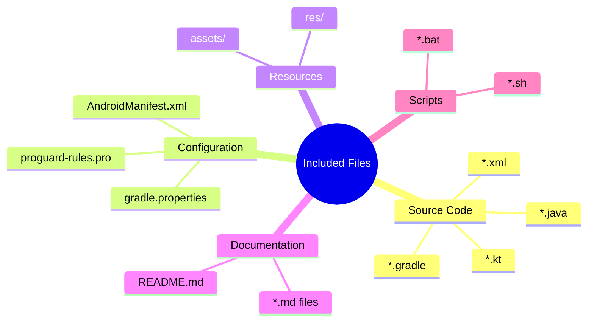
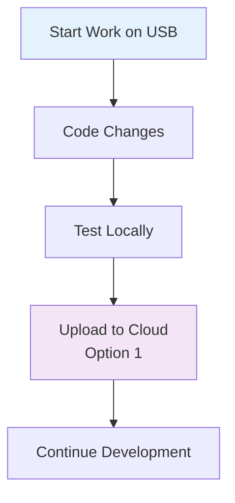
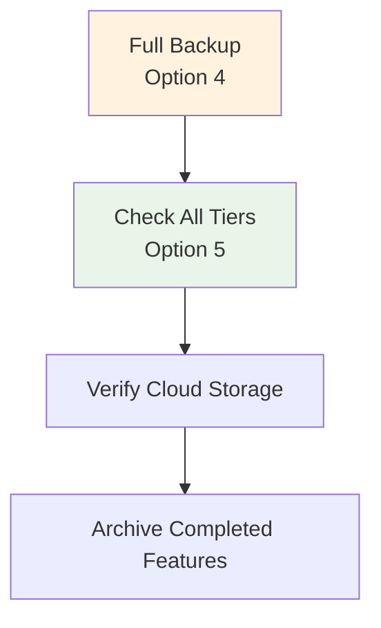

# 🏗️ Hybrid Tiered Sync Architecture - User Guide

## 📋 Overview

This system automatically syncs your Android development project across multiple cloud storage locations using a smart tiered approach. Think of it as having multiple backup layers - each optimized for different purposes.

### 🎯 What Does This Do?
- **Keeps your code safe** across multiple storage locations
- **Optimizes storage usage** by storing different types of files in appropriate places
- **Works seamlessly on Chromebook** environments
- **Filters out unnecessary files** to save space and sync time

---

## 🏗️ Architecture Overview

```mermaid
graph TD
    A[USB Drive<br/>📱 50GB Full Environment] --> B[Google Drive<br/>☁️ 14GB Essential Files]
    A --> C[Box.com<br/>📦 10GB Backup]
    A --> D[Mega.nz<br/>🗄️ 20GB Archive]
    
    style A fill:#e1f5fe
    style B fill:#f3e5f5
    style C fill:#fff3e0
    style D fill:#e8f5e8
```



### 🔄 Sync Flow Diagram



---

## 📊 Storage Tier Breakdown

| Tier | Storage | Purpose | Size Limit | What's Included | What's Excluded |
|------|---------|---------|------------|-----------------|-----------------|
| **Tier 1** | USB Drive | Full development environment | 50GB | Everything | Only largest temp files |
| **Tier 2** | Google Drive | Essential source code | 14GB | Source files, configs | Build files, IDE settings, .git |
| **Tier 3** | Box.com | Clean backup | 10GB | Source + docs | Build artifacts, large binaries |
| **Tier 4** | Mega.nz | Long-term archive | 20GB | Complete backup | .git directory only |

---

## 🚀 Getting Started

### 1️⃣ Prerequisites Setup

Before using the script, ensure you have:



**Required Software:**
- ✅ `rclone` (cloud sync tool)
- ✅ `bash` shell access
- ✅ Your cloud storage accounts

**Required Cloud Remotes:**
- 📱 `askme` → Google Drive
- 📦 `askme-box` → Box.com (optional)
- 🗄️ `askme-mega` → Mega.nz (optional)

### 2️⃣ Environment Detection

The script automatically detects your Chromebook environment by checking for the `/mnt/chromeos` folder.

---

## 🎮 Using the Script

When you run the script on your Chromebook, you'll see:

```
🏗️ TIERED SYNC OPTIONS:
1. 📤 Upload: USB → Cloud (Tiered)
2. 📥 Download: Cloud → USB (Selective)  
3. 🔄 Bidirectional: USB ↔ Google Drive (Essential)
4. 💾 Full Backup: USB → All Tiers
5. 📊 Tier Status Dashboard
6. ⚙️ Configure Tier Rules
7. 🧪 Test Sync (Dry Run)
8. 📋 View Sync Logs
9. ❌ Exit
```

### 📤 Option 1: Upload (USB → Cloud)
**What it does:** Backs up your USB project to all configured cloud storage tiers.

**Process Flow:**
```mermaid
sequenceDiagram
    participant USB as USB Drive
    participant GD as Google Drive
    participant BOX as Box.com
    participant MEGA as Mega.nz
    
    USB->>GD: Essential files only
    Note over GD: Source code, configs
    USB->>BOX: Clean backup
    Note over BOX: No build files
    USB->>MEGA: Archive copy
    Note over MEGA: Complete backup
```

### 📥 Option 2: Download (Cloud → USB)
**What it does:** Restores your project from cloud storage to USB.

**You choose the source:**
- Google Drive (essential files)
- Box.com (clean backup)
- Mega.nz (complete archive)

### 🔄 Option 3: Bidirectional Sync
**What it does:** Keeps your USB and Google Drive in sync with essential development files.

### 📊 Option 5: Status Dashboard
**What it shows:**
- Storage usage for each tier
- Available space
- Sync folder sizes
- Connection status

---

## 🎯 Smart Filtering System

### What Gets Excluded (Saved Space & Time)



### What Gets Included (Essential Development)



---

## 🧪 Testing & Validation

### Dry Run Testing
Before making actual changes, always test:

1. Choose option **7** (Test Sync)
2. Select which tier to test
3. Review the output to see what would be synced
4. No actual files are transferred

### Size Validation Warnings
The system automatically warns you if:
- Google Drive sync > 12GB
- Box.com sync > 8GB  
- Mega sync > 18GB

---

## 📋 Quick Reference Commands

### Manual Script Execution
```bash
# Make executable
chmod +x master_sync.sh

# Run the script
./master_sync.sh
```

### Understanding Log Messages
| Color | Level | Meaning |
|-------|--------|---------|
| 🔴 RED | ERROR | Something failed |
| 🟢 GREEN | SUCCESS | Operation completed |
| 🟡 YELLOW | WARN | Warning or issue |
| 🔵 BLUE | INFO | General information |
| 🟣 PURPLE | TIER | Tier-specific message |

---

## 🔧 Troubleshooting

### Common Issues & Solutions

| Problem | Symptom | Solution |
|---------|---------|----------|
| **Remote not configured** | "Remote 'askme' not configured" | Run `rclone config` to set up cloud storage |
| **Size limit exceeded** | Warning about tier limits | Move large files to higher tier (Mega) |
| **Sync failed** | Red error messages | Check internet connection and cloud storage permissions |
| **USB not found** | "Path not found" | Ensure USB is mounted at `/mnt/chromeos/removable/USBdrive/askme` |

### Emergency Recovery Steps

1. **If USB is lost:** Use option 2 to download from Google Drive
2. **If cloud sync fails:** Check `tiered_sync.log` for details
3. **For complete recovery:** Use option 2 with Mega.nz as source

---

## 💡 Best Practices

### ✅ Do's
- Always run dry-run tests first
- Check tier status regularly (option 5)
- Keep USB as your primary working copy
- Use Git for version control alongside this sync system

### ❌ Don'ts
- Don't store large binary files in Google Drive tier
- Don't rely solely on one storage tier
- Don't ignore size warnings
- Don't sync while other operations are running

---

## 🔄 Workflow Recommendations

### Daily Development Workflow


### Weekly Backup Workflow


---

## 📞 Feedback & Improvements

### How to Provide Feedback
1. **Visual Clarity**: Are the diagrams helpful? What's confusing?
2. **Process Flow**: Which steps need more detail?
3. **Error Handling**: What issues did you encounter?
4. **Feature Requests**: What sync options would be useful?

### Future Enhancement Areas
- [ ] Web-based dashboard for tier monitoring
- [ ] Automated conflict resolution
- [ ] Integration with more cloud providers
- [ ] Mobile app for sync management
- [ ] Real-time sync status notifications

---

## 📚 Additional Resources

### Learning More About Components
- **rclone Documentation**: [rclone.org](https://rclone.org)
- **Android Development**: [developer.android.com](https://developer.android.com)
- **ChromeOS Development**: [chromeos.dev](https://chromeos.dev)

### Support Channels
- Check the `tiered_sync.log` file for detailed error information
- Review the filter files created in the script directory
- Test individual rclone commands manually if needed

---

*Last Updated: June 2025 | Version: 1.0*
*This guide covers the Hybrid Tiered Sync Architecture for AskMe Android Development*