# Intelligent AI Model Discovery System - Mermaid Architecture

## System Overview Flowchart

```mermaid
flowchart TD
    %% External Data Sources
    subgraph EXT["🌐 External Data Sources"]
        HF["🤗 HuggingFace Hub<br/>400k+ Models"]
        OAI["🤖 OpenAI API<br/>GPT Models"]
        ANT["🧠 Anthropic API<br/>Claude Models"]
        GOO["✨ Google API<br/>Gemini Models"]
        OTH["🔄 Other Providers<br/>Azure, Cohere, etc."]
    end

    %% Connection Layer
    subgraph CONN["🔄 Connection Layer"]
        RL["Rate Limiting<br/>Token Bucket"]
        LB["Load Balancer<br/>Round Robin"]
        AM["Auth Manager<br/>API Keys"]
    end

    %% Phase 2: Discovery Engine
    subgraph DISC["📡 Phase 2: Discovery Engine"]
        subgraph MOD3["Module 3: Provider Discovery"]
            HFC["HuggingFace Client"]
            OAC["OpenAI Client"]
            ANC["Anthropic Client"]
            GOC["Google Client"]
            ORC["LangChain Orchestrator"]
        end
        
        subgraph MOD4["Module 4: Model Enumeration"]
            HS["Hub Scanner"]
            PS["Provider Scanner"]
            DA["Data Aggregator"]
            PP["Parallel Processor"]
            MF["Model Filter"]
            IU["Incremental Updater"]
            PT["Progress Tracker"]
        end
    end

    %% Phase 3: Validation Engine
    subgraph VAL["✅ Phase 3: Validation Engine"]
        subgraph MOD5["Module 5: API Validation"]
            ATF["API Testing Framework"]
            CV["Capability Verifier"]
            QA["Quality Analyzer"]
            PB["Performance Benchmarks"]
            RM["Reliability Monitor"]
            VR["Validation Reporter"]
        end
    end

    %% Phase 1: Foundation Layer
    subgraph FOUND["🧠 Phase 1: Foundation Layer"]
        subgraph MOD1["Module 1: Core Infrastructure"]
            LOG["Logging System<br/>Winston"]
            CFG["Config Management<br/>Joi"]
            ERR["Error Handling"]
            CLI["CLI Interface<br/>Commander"]
        end
        
        subgraph MOD2["Module 2: Database & Storage"]
            QDB["Qdrant Vector DB<br/>eu-central-1"]
            LC["Local Caching<br/>Memory + Disk"]
            FE["FastEmbed Engine<br/>BAAI/bge-small"]
            BR["Backup & Recovery"]
        end
    end

    %% Phase 4: Intelligent Systems
    subgraph INTEL["🤖 Phase 4: Intelligent Systems"]
        subgraph MOD6["Module 6: Intelligent Ranking"]
            MLS["ML-Powered Scoring"]
            CAR["Context-Aware Ranking"]
            UPL["User Preference Learning"]
            DSR["Domain-Specific Ranking"]
        end
        
        subgraph MOD7["Module 7: Advanced Search"]
            SS["Semantic Search"]
            NLP1["NLP Query Processing"]
            FSE["Faceted Search Engine"]
            RC["Result Clustering"]
        end
    end

    %% Module 8: RAG System
    subgraph RAG_SYS["💬 Module 8: RAG System"]
        KB["Knowledge Base Engine"]
        RP["RAG Pipeline (6 Stages)"]
        RCE["Recommendation Engine"]
        NLI["Natural Language Interface"]
    end

    %% Phase 5: Output Generation
    subgraph OUTPUT["📊 Phase 5: Output Generation"]
        subgraph MOD9["Module 9: Export System"]
            JDE["JSON Database Export"]
            CBR["CSV Business Reports"]
            MD1["Markdown Docs"]
            API1["API Catalogs & SDKs"]
            CT["Change Tracking"]
        end
    end

    %% Phase 6: Integration & Automation
    subgraph INTEGRATION["🔄 Phase 6: Integration & Automation"]
        subgraph MOD10["Module 10: Integration Sync"]
            DSE["Database Sync Engine"]
            GHA["GitHub Actions"]
            WNS["Webhook Notifications"]
            ASE["Automated Scheduling"]
            RRS["Rollback & Recovery"]
        end
    end

    %% Production Integrations
    subgraph PROD["🌍 Production Integrations"]
        SUP["Supabase Database"]
        GIT["GitHub Actions"]
        SLK["Slack Webhooks"]
        DIS["Discord Webhooks"]
        CLD["Cloud Platforms"]
    end

    %% Data Flow Connections
    EXT --> CONN
    CONN --> DISC
    DISC --> VAL
    VAL --> FOUND
    FOUND --> INTEL
    INTEL --> RAG_SYS
    RAG_SYS --> OUTPUT
    OUTPUT --> INTEGRATION
    INTEGRATION --> PROD

    %% Internal Connections
    HF --> HFC
    OAI --> OAC
    ANT --> ANC
    GOO --> GOC
    OTH --> ORC
    
    HS --> DA
    PS --> DA
    DA --> PP
    PP --> MF
    MF --> IU
    IU --> PT
    
    QDB --> FE
    FE --> LC
    LC --> BR
    
    MLS --> CAR
    CAR --> UPL
    UPL --> DSR
    
    SS --> NLP1
    NLP1 --> FSE
    FSE --> RC
    
    KB --> RP
    RP --> RCE
    RCE --> NLI
    
    JDE --> CBR
    CBR --> MD1
    MD1 --> API1
    API1 --> CT
    
    DSE --> GHA
    GHA --> WNS
    WNS --> ASE
    ASE --> RRS

    %% Styling
    classDef external fill:#e1f5fe
    classDef discovery fill:#f3e5f5
    classDef validation fill:#e8f5e8
    classDef foundation fill:#fff3e0
    classDef intelligent fill:#fce4ec
    classDef rag fill:#f1f8e9
    classDef output fill:#e3f2fd
    classDef integration fill:#fdf2e9
    classDef production fill:#e0f2f1

    class EXT external
    class DISC discovery
    class VAL validation
    class FOUND foundation
    class INTEL intelligent
    class RAG_SYS rag
    class OUTPUT output
    class INTEGRATION integration
    class PROD production
```

## Detailed Module Architecture

```mermaid
flowchart TB
    subgraph P1["Phase 1: Foundation Layer"]
        M1["Module 1: Core Infrastructure<br/>• Winston Logger<br/>• Joi Config<br/>• Commander CLI<br/>• Error Handling"]
        M2["Module 2: Database & Storage<br/>• Qdrant Vector DB<br/>• FastEmbed Engine<br/>• Local Caching<br/>• Backup System"]
    end
    
    subgraph P2["Phase 2: Discovery Engine"]
        M3["Module 3: Provider Discovery<br/>• HuggingFace Client<br/>• OpenAI Client<br/>• Anthropic Client<br/>• Google Client<br/>• LangChain Orchestrator"]
        M4["Module 4: Model Enumeration<br/>• Hub Scanner<br/>• Provider Scanner<br/>• Data Aggregator<br/>• Parallel Processor<br/>• Model Filter"]
    end
    
    subgraph P3["Phase 3: Validation Engine"]
        M5["Module 5: API Validation<br/>• API Testing Framework<br/>• Capability Verifier<br/>• Quality Analyzer<br/>• Performance Benchmarks<br/>• Reliability Monitor"]
    end
    
    subgraph P4["Phase 4: Intelligent Systems"]
        M6["Module 6: Intelligent Ranking<br/>• ML-Powered Scoring<br/>• Context-Aware Ranking<br/>• User Preference Learning<br/>• Domain-Specific Ranking"]
        M7["Module 7: Advanced Search<br/>• Semantic Search<br/>• NLP Query Processing<br/>• Faceted Search Engine<br/>• Result Clustering"]
    end
    
    subgraph P4_RAG["Phase 4: RAG System"]
        M8["Module 8: RAG System<br/>• Knowledge Base Engine<br/>• RAG Pipeline (6 Stages)<br/>• Recommendation Engine<br/>• Natural Language Interface"]
    end
    
    subgraph P5["Phase 5: Output Generation"]
        M9["Module 9: Export System<br/>• JSON Database Export<br/>• CSV Business Reports<br/>• Markdown Documentation<br/>• API Catalogs & SDKs<br/>• Change Tracking"]
    end
    
    subgraph P6["Phase 6: Integration & Automation"]
        M10["Module 10: Integration Sync<br/>• Database Sync Engine<br/>• GitHub Actions Integration<br/>• Webhook Notifications<br/>• Automated Scheduling<br/>• Rollback & Recovery"]
    end

    M1 --> M2
    M2 --> M3
    M3 --> M4
    M4 --> M5
    M5 --> M6
    M6 --> M7
    M7 --> M8
    M8 --> M9
    M9 --> M10
```

## Data Pipeline Flow

## Technical Implementation Stack

## System Benefits Overview

```mermaid
flowchart TD
    A["🤖 AUTOMATED"] --> A1["24/7 Operation"]
    A["🤖 AUTOMATED"] --> A2["No Manual Intervention"]
    
    B["🎯 INTELLIGENT"] --> B1["AI-Powered Search"]
    B["🎯 INTELLIGENT"] --> B2["ML Recommendations"]
    
    C["🔍 COMPREHENSIVE"] --> C1["400k+ Models"]
    C["🔍 COMPREHENSIVE"] --> C2["All Major Providers"]
    
    D["✅ VALIDATED"] --> D1["Live API Testing"]
    D["✅ VALIDATED"] --> D2["Quality Assurance"]
    
    E["📊 ANALYTICAL"] --> E1["Performance Analysis"]
    E["📊 ANALYTICAL"] --> E2["Cost Comparison"]
    
    F["🔄 REAL-TIME"] --> F1["Continuous Updates"]
    F["🔄 REAL-TIME"] --> F2["Instant Notifications"]
    
    G["📋 MULTI-FORMAT"] --> G1["JSON/CSV/MD"]
    G["📋 MULTI-FORMAT"] --> G2["API Specs"]
    
    H["🛡️ ENTERPRISE"] --> H1["Security & Monitoring"]
    H["🛡️ ENTERPRISE"] --> H2["Rollback & Recovery"]
```

